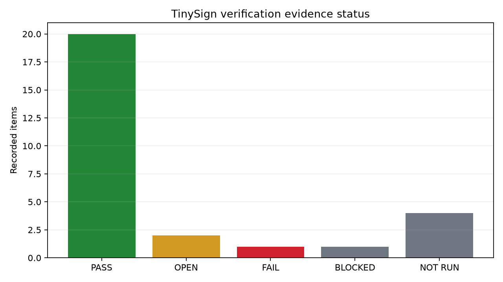
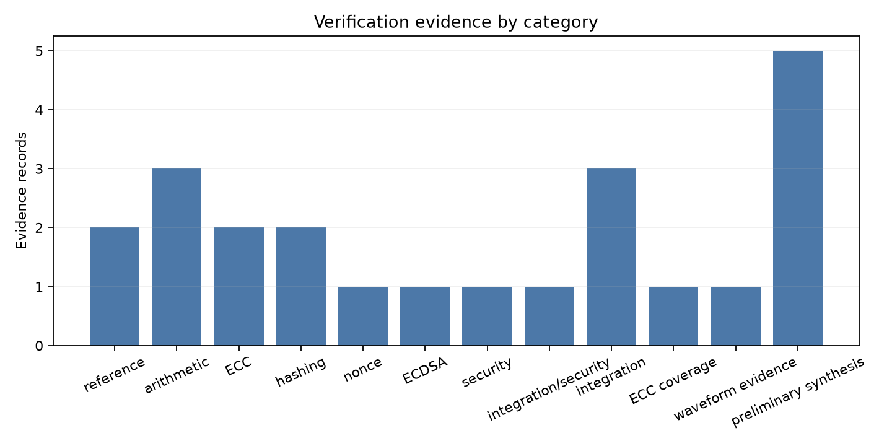
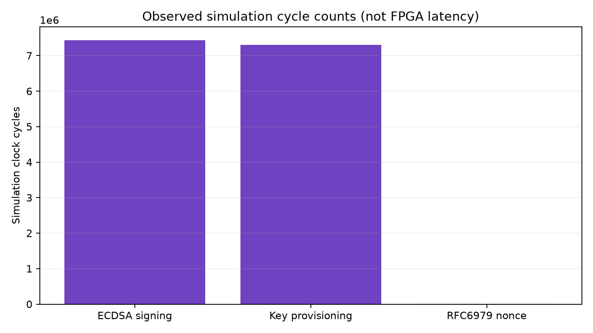

# PURI-Sign Verification Report

**Project:** PURI-Sign — prototype hardware security boundary for ECDSA digital signing on NIST P-256  
**Target:** DE10-Nano / Intel Cyclone V SoC  
**Evidence date:** 2026-10-07 (UTC timestamps are retained in the source manifests)

## Evidence provenance

This report distinguishes three evidence groups. First, the Python P-256 reference suite was rerun in the current Windows session and passed all 9 unittest cases. Second, the full Icarus regression and direct Python/RTL arithmetic comparison are timestamped captured runs in `reports/validation` and `reports/arithmetic_comparison`; their PASS status is reported as recorded evidence, not as a rerun in this session. Third, Yosys result files are recorded preliminary checks/mapping attempts. In the current session `iverilog`, `vvp`, `yosys`, and `quartus_sh` were not on PATH, and WSL could not start `/bin/bash`, so Icarus and Yosys could not be rerun. The generated package contains copied logs at `icarus/`; key-like scalar values have been redacted in the pre-existing scalar-multiplication transcript and its package copy, with a note. This redaction preserves pass/fail messages and measured cycle counts.

The previous Icarus manifest is timestamped `2026-10-07T09:31:19Z`; the direct arithmetic comparison is timestamped `2026-10-07T10:03:10Z`. Their source hashes identify the implementation files used for those runs. The current testbench console redaction changes only scalar display text, not its vectors, assertions, or DUT. No claim below treats those older runs as fresh execution.

## 1. Verification Objective

The objective is to evaluate whether the RTL implements modular arithmetic, P-256 point operations, SHA-256/HMAC/RFC6979, deterministic ECDSA signing, and protected-key register behavior for the PURI-Sign prototype. The tests demonstrate selected functional properties and interface behavior. They do not establish physical tamper resistance, side-channel resistance, fault-injection resistance, production security, or FPGA implementation quality.

## 2. Verification Environment

- Maintained RTL: Verilog-2001 `.v` under `rtl/`.
- Testbenches: `tb/*.v`; simulation runner uses Icarus `-g2001` and `vvp`.
- Reference: standard-library Python P-256/RFC6979 code under `python/` and `tests/`.
- Preliminary synthesis: Yosys scripts under `scripts/run_yosys.py`, with captured output in `reports/yosys/`.
- FPGA target files: `quartus/PURI-Sign.qpf`, `.qsf`, and `.sdc`.
- Current-session Python rerun: Python 3.11 environment, 9 unittest cases passed. The recorded Icarus manifest reports Python 3.12.3 and the prior arithmetic comparison also records its tool output and vector results.
- Current-session Icarus/Yosys/Quartus rerun: NOT RUN because executables are unavailable in the current Windows/WSL environment.

## 3. Verification Strategy

Verification uses deterministic testbench vectors, selected expected-result assertions, Python reference comparison where present, and Yosys structural checks. The full recorded Icarus manifest lists 14 passing jobs: Python reference, 11 functional RTL testbenches, and the UART and board-selftest simulations. The direct arithmetic comparison records 254 exact matches. These records establish only the covered vectors and observable behavior; they are not formal proofs or exhaustive input-space verification.

### Verification summary

| Category | Test | Tool | Status | Evidence |
|---|---|---|---|---|
| Arithmetic | P-256 `mod_add`, `mod_sub`, `mod_inv`, multiply/Montgomery | Icarus + Python | PASS (recorded) | `icarus/tb_mod_arith.log`, `icarus/python_vs_rtl_results.json` |
| ECC | Selected point ops and scalar vectors | Icarus | PASS (recorded); infinity operands OPEN | `icarus/tb_point_ops.log`, `icarus/tb_scalar_mult.log` |
| Hashing | SHA-256 vectors and HMAC known-answer vectors | Icarus | PASS (recorded) | `icarus/tb_sha256_hash.log`, `icarus/tb_hmac.log` |
| Nonce | RFC6979 vector, repeatability, range rejection | Icarus | PASS (recorded) | `icarus/tb_rfc6979.log` |
| ECDSA | RFC6979 P-256 exact `r,s` and independent Python verification | Icarus + Python | PASS (recorded + Python rerun) | `hero_ecdsa_evidence.md` |
| Security | Provisioning, lock, readback, signature, zeroization | Icarus | PASS (recorded) | `icarus/tb_key_manager.log`, `icarus/tb_tinysign_core.log` |
| Integration | Core, wrapper, UART, board self-test simulation | Icarus | PASS (recorded) | `icarus/tb_tinysign_core.log`, `icarus/tb_tinysign_de10nano.log`, `icarus/tb_selftest_uart.log`, `icarus/tb_board_selftest.log` |
| Preliminary synthesis | Yosys structural checks | Yosys 0.33 | PASS (recorded) | [`tinysign_core_check`](../../reports/yosys/tinysign_core_check/console.log), [`tinysign_de10nano_check`](../../reports/yosys/tinysign_de10nano_check/console.log) |
| Experimental mapping | Cyclone V DE10 wrapper mapping | Yosys 0.33 | FAIL, exit −9 | [`console.log`](../../reports/yosys/tinysign_de10nano_cyclonev/console.log) |
| FPGA build | Quartus compile | Quartus | BLOCKED / NOT RUN | Quartus unavailable; no build output |
| FPGA implementation | Fit, timing, `.sof`, physical board test | Quartus / DE10-Nano | NOT RUN | No implementation or board evidence |

“Recorded” indicates timestamped prior-run evidence, not execution during this Windows session. The Yosys mapping failure is an actual recorded tool failure, separate from the blocked Quartus flow.

The figures below summarize counts and measurements from the result records. They do not estimate FPGA resources or timing.

## 4. Modular Arithmetic Verification

**What and why:** modular add, subtract, multiply, Montgomery multiply, and inverse support scalar and point arithmetic. Incorrect reduction or handshake behavior would invalidate higher-level cryptographic results.

**Recorded result:** `tb_mod_arith` and `tb_montgomery_mul` passed. The direct Python-versus-RTL comparison reports 254/254 exact matches for `mod_add`, `mod_sub`, and `mod_inv` over both P-256 field prime `p` and group order `n`, including boundaries, deterministic random values, and inverse-of-zero rejection. Montgomery vectors cover multiple widths, including 256 bits, in the recorded suite. Python/RTL arithmetic direct comparison was therefore tested in the repository evidence even though an older status note said otherwise.

**Evidence:** `icarus/tb_mod_arith.log`, `icarus/tb_montgomery_mul.log`, `icarus/python_vs_rtl_results.json`, `icarus/python_vs_rtl_icarus.log`, and `icarus/python_vs_rtl_vectors.txt`.

## 5. ECC Verification

**What and why:** affine P-256 public results are derived from Jacobian point operations; scalar multiplication drives key derivation and ECDSA.

**Recorded result:** point-operation simulation passed the base point/doubling/addition and selected equality/inverse-point cases. Scalar-multiplication simulation passed its selected vectors, including `k=0,1,2,3,n` and deterministic key-like scalars; the testbench reports 7,169,024 cycles for each completed fixed-round case. The test suite does not establish infinity-operand coverage for `P + O` and `O + P`; those cases remain OPEN. Doubling edge cases beyond the captured tests remain OPEN.

**Evidence:** `icarus/tb_point_ops.log`, `icarus/tb_scalar_mult.log`, and current source testbenches `tb/tb_point_ops.v` and `tb/tb_scalar_mult.v`.

## 6. SHA-256 Verification

**What and why:** hashing creates the fixed-width digest consumed by RFC6979 and ECDSA.

**Recorded result:** SHA-256 simulation passed the empty message, `abc`, and 56-byte vector. The captured testbench reports 67 cycles for the empty and 3-byte cases, and 134 cycles for the 56-byte case.

**Evidence:** `icarus/tb_sha256_hash.log`.

## 7. HMAC-SHA-256 Verification

**What and why:** HMAC-SHA-256 is the keyed primitive used by RFC6979 deterministic nonce derivation.

**Recorded result:** the captured testbench passed RFC 4231 test case 2 and the 97-byte RFC6979 inner-message vector.

**Evidence:** `icarus/tb_hmac.log`.

## 8. RFC6979 Verification

**What and why:** deterministic nonce generation avoids reliance on an external runtime random source while requiring correct secret-key handling and rejection of invalid values.

**Recorded result:** the captured P-256/SHA-256 nonce known-answer test passed, repeatability passed, and zero private-key rejection passed. The transcript reports 1,519 simulation cycles for the nonce vector. The reported cycle count is a simulator count only.

**Evidence:** `icarus/tb_rfc6979.log` and the current Python reference rerun in `icarus/python_reference_current.log`.

## 9. ECDSA P-256 Verification

**What and why:** ECDSA signing is PURI-Sign's primary function. Exact deterministic signature comparison plus an independent verifier checks both the RTL result and reference implementation.

**Hero vector:** RFC 6979 Appendix A.2.5, ECDSA over NIST P-256 with SHA-256. The message is `sample`; its SHA-256 digest is `AF2BDBE1AA9B6EC1E2ADE1D694F41FC71A831D0268E9891562113D8A62ADD1BF`. Private key: **REDACTED**.

| Result | Value / status |
|---|---|
| Python/reference expected `r` | `EFD48B2AACB6A8FD1140DD9CD45E81D69D2C877B56AAF991C34D0EA84EAF3716` |
| Python/reference expected `s` | `F7CB1C942D657C41D436C7A1B6E29F65F3E900DBB9AFF4064DC4AB2F843ACDA8` |
| RTL actual `r` | Exact match to expected `r` (testbench assertion passed) |
| RTL actual `s` | Exact match to expected `s` (testbench assertion passed) |
| Independent Python signature verification | PASS in Python reference RFC6979 P-256 test |
| RTL signing test | PASS; captured simulator count: 7,437,838 cycles |

The RTL transcript asserts equality against both expected signature components and passes. The Python model independently verifies the signature in its reference test. The transcript does not print raw actual `r` and `s` on success, so the values shown are the testbench's expected public vector; RTL equality is established by the passing assertion.

**Evidence:** `icarus/tb_ecdsa_signer.log`, `icarus/python_reference_current.log`, `tb/tb_ecdsa_signer.v`, and `tests/test_p256.py`.

## 10. Security Boundary Verification

**What each captured check demonstrates:**

1. **Provisioning:** key-manager test accepts complete in-range staging and derives the corresponding public point; rejects incomplete provisioning and zero/out-of-range input. This shows the tested provisioning control path and selected range checks.
2. **Lock:** after lock, a staging write does not change the active signing key. This shows the tested RTL lock behavior.
3. **No normal key readback:** core test reads the private-key staging/key register address before and after provisioning and observes zero. This shows the tested MMIO read path does not return the private key under those transactions; it is not a proof against all internal leakage paths.
4. **Signature output:** core test reads the expected `r` and `s` words through signature registers after signing.
5. **Zeroization:** key-manager test observes cleared key, validity, lock, and public state. Core test interrupts signing/clears signature visibility and checks signer and RFC6979 key registers are cleared/reset.
6. **Invalid input behavior:** signer/RFC6979 tests reject zero key inputs. Broader fault and reset/error scenarios remain limited to testbench coverage.

This evidence supports the wording **prototype hardware security boundary** and **protected private-key handling in tested RTL paths**. It does not establish tamper-proofing, physical tamper resistance, power/EM side-channel resistance, fault-injection resistance, or production secure-element status.

**Evidence:** `icarus/tb_key_manager.log`, `icarus/tb_tinysign_core.log`, `icarus/tb_ecdsa_signer.log`, and the corresponding testbenches. No key-containing signing/key-manager VCD was published.

## 11. PURI-Sign Integration Verification

**What and why:** integration tests exercise host writes, provisioning/lock/sign commands, busy state, status and public signature readback, and key non-readback through the register interface. Wrapper and self-test simulations check supporting interfaces.

**Recorded result:** core register flow, DE10-Nano wrapper, UART report, and board self-test simulations are marked PASS in the captured full regression. Core evidence includes register-controlled provisioning, lock status, signature-valid status, signature readback, and zeroization/readback checks. Board self-test simulation is not physical-board evidence.

**Evidence:** `icarus/tb_tinysign_core.log`, `icarus/tb_tinysign_de10nano.log`, `icarus/tb_selftest_uart.log`, and `icarus/tb_board_selftest.log`.

## 12. FPGA Implementation Status

### FPGA Implementation Status

- Target: DE10-Nano / Intel Cyclone V SoC.
- Quartus compile: **NOT RUN / BLOCKED**; Quartus is not available in the current environment.
- FPGA synthesis in Quartus: **NOT YET VERIFIED**.
- Place and route: **NOT RUN**.
- Timing analysis / timing closure: **NOT RUN**.
- `.sof` generation: **NOT RUN**.
- Physical DE10-Nano test: **NOT RUN**.

Yosys 0.33 structural `check` outputs exist for `tinysign_core`, `tinysign_de10nano`, and the self-test top, and those recorded checks passed. A recorded experimental `synth_intel_alm` mapping for `mod_mul` passed. The experimental `tinysign_de10nano` mapping has a recorded exit `-9`; this is an actual Yosys run failure, not a Quartus failure. These Yosys results are preliminary tool outputs and do not establish Quartus resource utilization, timing, a fitted FPGA image, or hardware operation. The captured Cyclone V wrapper mapping produced no accepted implementation report.

**Evidence:** source Yosys metadata and console logs under [`reports/yosys`](../../reports/yosys/); QPF/QSF/SDC project inputs are under [`quartus`](../../quartus/).

## 13. Verification Limitations

- Icarus/Yosys were not rerun in the current session because the tools were unavailable; stored results are identified as prior recorded runs.
- Functional tests cover selected vectors, not all possible inputs or formal properties.
- Infinity operand and other ECC edge coverage is incomplete.
- The signing testbench uses a known deterministic test vector; it does not validate entropy or production provisioning.
- Security evidence is limited to RTL simulation and selected readback/zeroization observations.
- No ECDSA, key-manager, or top-level VCD is available. The included VCD is a Montgomery demonstration only.
- Simulation cycle counts are not FPGA latency. The RTL testbenches use a 10 ns simulation clock period, but that stimulus does not establish the DE10-Nano clock configuration or achievable timing. No signing latency in seconds or maximum frequency is claimed.
- Quartus synthesis, fitting, timing, programming-file generation, board capture, and physical validation have not been performed.

Captured simulation cycle counts are also plotted separately; no cycle-to-time conversion is made.

## 14. Conclusion

Captured functional evidence supports selected modular arithmetic, P-256 point/scalar operations, SHA-256/HMAC/RFC6979, deterministic ECDSA signing, and protected-key register behavior in simulation. The strongest result is the exact match to the RFC6979 P-256 signature vector plus independent Python verification. Python reference tests were rerun successfully in the current session; Icarus and Yosys results remain timestamped prior evidence. FPGA implementation and physical validation remain open, and no FPGA timing or resource claim is supported.

